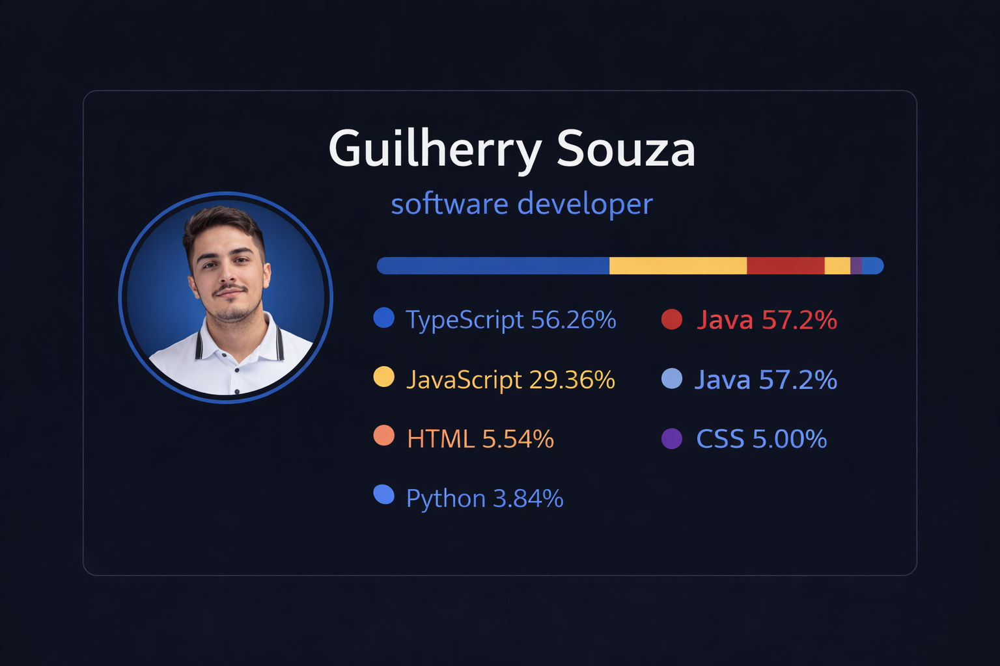

<h2 align="center"> Olá, Eu sou Guilherry Souza! </h2>

   Desenvolvedor apaixonado por tecnologia |  Sempre aprendendo novas linguagens

---

## 

<table>
  <tr>
    <td>
      
    </td>
    <td>
    </td>
  </tr>
</table>

---

## 

  
  
  
  
  
  
  
  
  
  
  
  

---

## 

 

  
  
  
  
  

---

## 
<picture align="center">
  <source media="(prefers-color-scheme: dark)" srcset="https://raw.githubusercontent.com/guilherrysouza/guilherrysouza/output/github-contribution-grid-snake-dark.svg">
  <source media="(prefers-color-scheme: light)" srcset="https://raw.githubusercontent.com/guilherrysouza/guilherrysouza/output/github-contribution-grid-snake-dark.svg">
  
</picture>
